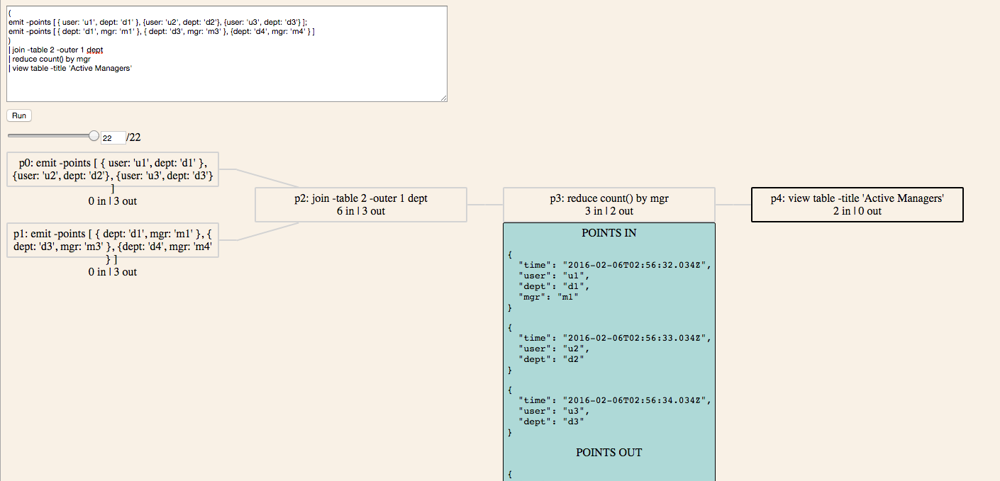

Debugging Juttle
================

As with any programming language, coding in Juttle will at some point call for debugging tools to help make sense of a program's behavior.

[TOC]

## Turning On Debug Logging

To run a Juttle program with debug logging on from the CLI, do:

```
DEBUG=* juttle <program-file.juttle>
```

or

```
DEBUG=* juttle -e "juttle-program"
```

To run programs in the browser environment with debug logging, first enable debug logs for juttle-service: set `--log-config <log4js-config-path>` and specify desired log level in the log4js config, as described in the [juttle-service README](https://github.com/juttle/juttle-service). Exposing the logs in the juttle-viewer is tracked by the issue [juttle-viewer#7](https://github.com/juttle/juttle-viewer/issues/7).

## Print-style Debugging: (pass | view text)

:construction: This section will be updated when issue [juttle-viewer#9](https://github.com/juttle/juttle-viewer/issues/9) add the ability to `view trace`.

Output data as it's moving through the Juttle flowgraph by inserting this statement into any flowgraph node(s):

```text
| (pass; view text)
```

The helper proc `pass` will allow the data to proceed to the next node of the flowgraph, while `view text` will output the same data in raw text format. If using this in a program with multiple text outputs, we can name the view for readability (the text view doesn't support title, so we'd use the table view then):

```
| (pass; view table -title 'Debug Node 1')
```

This style of debugging is particularly useful to analyze `join`, `filter` and `reduce` steps of a Juttle program, to see if the data is being transformed as you expect.

## Debugging Bigger Data: (pass; write file)

Programs that are amenable to debugging with `(pass; view text)` approach are necessarily those that have small numbers of data points flowing through them. Bigger data would overwhelm the console and the human looking at it. To debug such programs, we will write out the data we are snooping on, so we can look through the data file out of band. 

There are two possible places where to write out the data file:

   1. The local filesystem where the console or browser is executing;
   2. The remote filesystem where juttle-service is executing.

The local case is handled by:

   - running the program via CLI and using `(pass; write file -file 'local_file_path')`, or
   - running the program via juttle-viewer and using `(pass; view file)` which will write the file to the browser's downloads directory;
   - with either approach, we would then `read file -file 'local_file_path` to see the data.

The remote case is handled by:

   - running the program via juttle-engine and using `(pass; write file -file 'remote_file_path')` (any file path would be interpreted as remote, i.e. local to where the outrigger server is executing), and
   - then running another program to read that file, namely `read file -file 'remote_file_path'`, as we cannot access the remote file in any other way (unless we have ssh access to the juttle-service host).

## Visualizing Juttle Flowgraphs

For programs with complex logic, it can be helpful to visualize how the points progress through the flowgraph. The [Juttle Flowgraph Visualizer](https://github.com/juttle/juttle-flowgraph-viz) tool does just that, rendering a live graphical representation of your program's execution.

In the visualizer, we can see points with their field names and values as they enter and exit each flowgraph node of the program. We can also rewind the program, stepping forward and backward in time. 

Currently only programs using the synthetic data sources such as `emit` can be visualized. We can make any Juttle program visualizable by first obtaining the JSON of points via `(pass; view text)` or `(pass; write file)`, and then release a set of those points with `emit -points` like this:

```
emit -points [ {time: t1, field: f1}, {time: t2, field: f2 } ]
| ... // the rest of the program logic 
```

## Debugging Version Problems

Sometimes programs exhibit unexpected behavior because the active versions of Juttle and adapters are mismatched due to `npm install` in an unusual location. To debug such a situation, helpful commands on the CLI are:

```
juttle --version
juttle --adapters
```

The same information can be exposed inside a running Juttle program using the [Juttle module](../modules/juttle.md).

## Debugging Optimizations

Juttle programs that read from backends using juttle adapters will often attempt to optimize execution by handing off more than just read of raw data to the backend. See, for example, the Optimizations section of the [juttle-elastic-adapter README](https://github.com/juttle/juttle-elastic-adapter).

To see how the adapter formed the query for the backend, follow [Turning On Debug Logging](#turning-on-debug-logging) steps; the query API call will be printed to the juttle-service log.

If the optimizations aren't working as expected, they can be turned off by passing a flag to the `read` proc in the program:

```
read <adapter> -optimize false ...
```

This can help isolate the problem to an optimization bug. If you ever encounter one, please file a GitHub issue in the appropriate adapter's repository.

## Setting Breakpoints

This method of debugging is not yet supported for Juttle; use print-style debugging or the flowgraph visualizer instead.

## Example

Say we start with this Juttle program, with the intent of joining user data against a lookup table of department/manager mapping.

```
(
emit -points [ { user: 'u1', dept: 'd1' }, {user: 'u2', dept: 'd2'}, {user: 'u3', dept: 'd3'} ];
emit -points [ { dept: 'd1', mgr: 'm1' }, { dept: 'd3', mgr: 'm3' }, {dept: 'd4', mgr: 'm4' } ]
) 
| join -table 2 -outer 1 dept
| reduce count() by mgr
| view table -title 'Active Managers'
```

When we run it, we end up being surprised by a 'null' manager in the output. There is also a warning that doesn't immediately make sense, as surely the field `mgr` is present in the data:

```
Warning: group by undefined field "mgr"
Active Managers
┌──────────┬──────────┐
│ count    │ mgr      │
├──────────┼──────────┤
│ 1        │ m1       │
├──────────┼──────────┤
│ 1        │ null     │
├──────────┼──────────┤
│ 1        │ m3       │
└──────────┴──────────┘
```

What happened? Let's debug by adding `(pass; view table)` into the program after the `join` step. (We could also remove everything after the `join` step from the program, but that approach is fraught with danger of losing code and getting confused about the original intention of the program.)

```
(
emit -points [ { user: 'u1', dept: 'd1' }, {user: 'u2', dept: 'd2'}, {user: 'u3', dept: 'd3'} ];
emit -points [ { dept: 'd1', mgr: 'm1' }, { dept: 'd3', mgr: 'm3' }, {dept: 'd4', mgr: 'm4' } ]
) 
| join -table 2 -outer 1 dept
| (pass; view table)
| reduce count() by mgr
| view table -title 'Active Managers'
```

The output now includes this table view of the data after joining, where we can clearly see that user u2 was not matched up with any manager.

```
┌──────┬─────┬──────┐
│ dept │ mgr │ user │
├──────┼─────┼──────┤
│ d1   │ m1  │ u1   │
├──────┼─────┼──────┤
│ d2   │     │ u2   │
├──────┼─────┼──────┤
│ d3   │ m3  │ u3   │
└──────┴─────┴──────┘
```

It now makes sense why the later `reduce` step generated a point with `null` value, since there had to be a manager-less data point. We can fix that by expanding the lookup table to include department d2, or live with the warning, if the data truly must be like this.

```
(
  emit -points [ { user: 'u1', dept: 'd1' }, {user: 'u2', dept: 'd2'}, {user: 'u3', dept: 'd3'} ];

  emit -points [ { dept: 'd1', mgr: 'm1' }, {dept: 'd2', mgr: 'm2' }, { dept: 'd3', mgr: 'm3' }, {dept: 'd4', mgr: 'm4' } ]
)
| join -table 2 -outer 1 dept
| reduce count() by mgr
| view table -title 'Active Managers'
```

Output is now as expected:

```
Active Managers
┌──────────┬──────────┐
│ count    │ mgr      │
├──────────┼──────────┤
│ 1        │ m1       │
├──────────┼──────────┤
│ 1        │ m2       │
├──────────┼──────────┤
│ 1        │ m3       │
└──────────┴──────────┘
```

The program runs without errors or warnings, and we have used the Juttle debug tool `(pass; view table)` to improve it. In cases where data points are wider, the more compact output of `(pass, view text)` works best.

We could also write the data points out to a file (not needed in this example with a tiny data set, but useful in programs that read lots of data):

```
(
emit -points [ { user: 'u1', dept: 'd1' }, {user: 'u2', dept: 'd2'}, {user: 'u3', dept: 'd3'} ];
emit -points [ { dept: 'd1', mgr: 'm1' }, { dept: 'd3', mgr: 'm3' }, {dept: 'd4', mgr: 'm4' } ]
) 
| join -table 2 -outer 1 dept
| (pass; write file -file '/tmp/debug.out')
| reduce count() by mgr
| view table -title 'Active Managers'
```

Now the file `/tmp/debug.out` contains the JSON array of data to help us debug.

We can also see what this program does in a visual way, by running it through the [Juttle Flowgraph Visualizer](https://github.com/juttle/juttle-flowgraph-viz). Once installed, we visit its page in the browser, enter the original program text, and run it to see:



And to get debug logging from this program, we will save the Juttle code to a file first, and then run like this:

```
$ DEBUG=* juttle active_managers.juttle
[2016-02-05 19:12:40.739] [DEBUG] config - loading /Users/newbie/.juttle/config.json
[2016-02-05 19:12:40.745] [DEBUG] juttle-adapter - configuring builtin adapters
Warning: group by undefined field "mgr"
Active Managers
┌──────────┬──────────┐
│ count    │ mgr      │
├──────────┼──────────┤
│ 1        │ m1       │
├──────────┼──────────┤
│ 1        │ null     │
├──────────┼──────────┤
│ 1        │ m3       │
└──────────┴──────────┘
```

Since this program doesn't use a real data source, there's not much to log about. In programs using `read`, we'd see logging output from the juttle adapter which talks to the backend data source, including the translation of the juttle query into the backend API call.

## Got Stuck?

If you are debugging a Juttle issue and get stuck, ask us a question in the [gitter chat room](https://gitter.im/juttle/juttle)!
