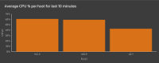
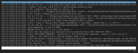
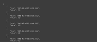

view
====

The view sink syntax includes the keyword `view` followed by a particular view name.

```
... | view <view> [view-parameters]
```

The built-in views available in the Juttle CLI are `view table` and ` view text`.

The [juttle-viz](https://github.com/juttle/juttle-viz) package provides a variety of customizable charts for output in the browser, see [below](#browser-charts).

If your program doesn't specify an output, the default is `view table`.

A program can have multiple view sinks; their visual layout will depend on the visualization solution.

## CLI Views

**[table](../sinks/view_table.md)**

Display the output as text in rows and columns. *This is the default output if no other is specified.*

**[text](../sinks/view_text.md)**

Display a raw dump of the output in a fixed-width, console-style font.

## Browser Charts

These charts are supplied by the [juttle-viz charting library](https://github.com/juttle/juttle-viz) which seamlessly integrates with Juttle.

To use these charts, follow installation instructions for juttle-viz, or try out the integrated Juttle analytics environment [juttle engine](https://github.com/juttle/juttle-engine).

Sink | Description | Image
---- | ----------- | -----
**barchart** | Display the output as vertical or horizontal bars for comparing different categories of data. | 
**events** | Overlay events on top of a time chart, with a tooltip whose format can be customized.  | 
**less** | View the `time` and `message` field values of points. You can search and navigate as you would with the UNIX less command. | 
**text** | Display a raw dump of the output in a fixed-width, console-style font. | 
**piechart** | Render data as a pie chart, showing proportions of a whole. | 
**scatterchart** | Plot data points as individual dots across two axes sourced from the data fields. | 
**table** | Display the output as text in rows and columns. This is the default output if no other is specified. | 
**tile** | Render a metric tile displaying exactly one value.  | 
**timechart** | Create a time series chart. Time charts support multiple series and can be combined with `view events`  | 

## Defining View Parameters

Parameters for a view can be specified individually,
or as object literals using the `-options` parameter (`-o` for short).

Individually specified parameters are shown in the syntax reference for each view.
A simple example with individual parameters looks like this:

```
... | view barchart
        -title "CPU usage"
        -value value
```

The example above can also be expressed with object literals like this:

```
... | view barchart -options { title: "CPU usage", value: value }
```

The two formats can also be combined, like this:

```
... | view barchart
        -title "CPU usage"
        -o { value: value }
```

If you've worked with JavaScript, the `-options` method will look familiar. It
provides additional flexibility by allowing you to store parameters as
vars or consts, like this:

```
const timechartOptions = {
title: 'Average CPU Usage'
};
... | view timechart -options timechartOptions
```

They can also be defined in a module and referenced in another program:

```
// module "standards"
export const cpu_chart_params = {
  series: [ { field: 'cpu', color: 'blue', label: 'cpu usage', unit: 'percent' } ],
  ...
};

// main program:
import "standards" as standards;
... | view timechart
        -options standards.cpu_chart_params
        -title "cpu usage"
```

:information_source: `Note:` If a parameter is specified more
than once, the last instance overrides any previous instances. For
example, both of these imaginary programs produce a time chart whose
title is "the real title":

```
... | view timechart
        -title "ignored"
        -o { title: "the real title" }
... | view timechart
        -o { title: "not the title" }
        -title "the real title"
```
